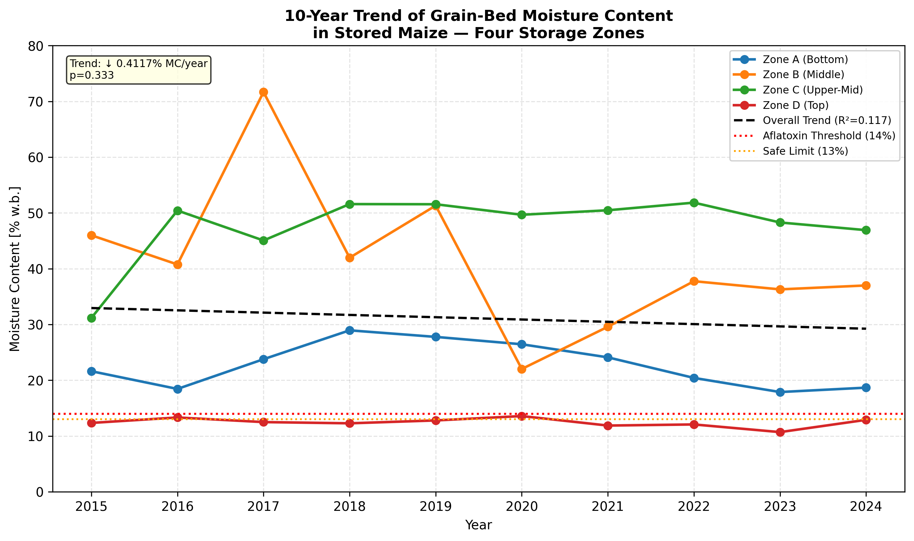
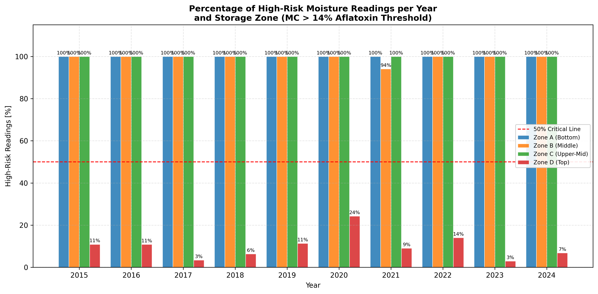
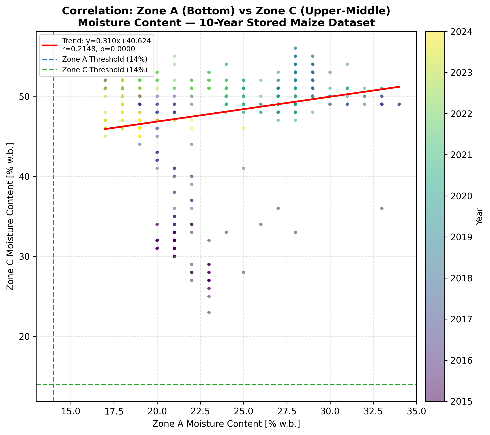
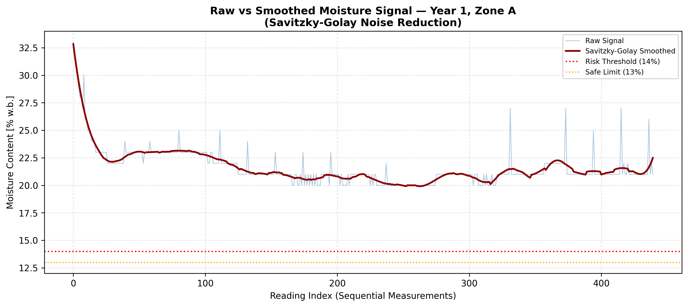

# Aflatoxin Risk Assessment in Stored Maize Using Grain-Bed Moisture Sensor Data

**AGE 219 – Basics of Computer Programming | Capstone Project**
**Sokoine University of Agriculture (SUA)**

---

## Project Details

| Field | Details |
|---|---|
| **Author** | Marwa Marwa Joseph |
| **Registration No.** | [BPE/D/2024/0005.] |
| **Course** | AGE 219 – Basics of Computer Programming |
| **Instructor** | Dr. Kadeghe Fue, PhD, P.Eng (T) |
| **Submission Date** | 2nd July 2026 |

---

## Problem Statement

Do moisture content levels in stored maize grain, measured by embedded sensors across four vertical storage zones over 10 years (2015–2024), persistently exceed the critical threshold of 14% at which aflatoxin-producing fungi proliferate?

Aflatoxins are toxic substances produced by Aspergillus flavus fungi in stored maize. They cause cancer and are dangerous to human health. In Tanzania, aflatoxin contamination causes 25–40% post-harvest losses annually. The main cause is high grain moisture content during storage.

Safe storage requires moisture content below 13%. Above 14% moisture, aflatoxin fungi grow rapidly.

---

## Sensor Zone Configuration
ZONE D (Top)        ← moisture3
ZONE C (Upper-Mid)  ← moisture2
ZONE B (Middle)     ← moisture1
ZONE A (Bottom)     ← moisture0
---

## Data Source

- 10 CSV files (Year1.csv to Year10.csv)
- March harvest season readings 2015–2024
- 4 capacitive moisture sensors per year
- Total: 4,409 observations
- kaggle.com

---

## Repository Structure
AGE219/
├── Year1.csv ... Year10.csv   (raw sensor data)
├── 01_data_cleaning.py        (Phase 3.1)
├── 02_statistical_analysis.py (Phase 3.2)
├── 03_visualization.py        (Phase 4)
├── plot1_trend_analysis.png
├── plot2_categorical_comparison.png
├── plot3_correlation.png
├── plot4_smoothed_signal.png
└── README.md
---

## Methodology

### Phase 3.1 — Data Cleaning (Pandas)
- Loaded all 10 CSV files using glob and pd.read_csv()
- Merged into one DataFrame using pd.concat()
- Cleaned missing values and outliers
- Added timestamp and aflatoxin risk flag

### Phase 3.2 — Statistical Analysis (NumPy and SciPy)
- NumPy: Converted moisture to percentage and calculated risk index
- SciPy: Linear regression trend analysis
- SciPy: Pearson correlation between zones
- SciPy: Savitzky-Golay smoothing filter
- SciPy: One-sample t-test vs safe threshold

---

## Results

### Annual Mean Moisture Content

| Year | Zone A | Zone B | Zone C | Zone D | Mean |
|------|--------|--------|--------|--------|------|
| 2015 | 21.6% | 46.0% | 31.2% | 12.4% | 27.8% |
| 2016 | 18.5% | 40.8% | 50.4% | 13.3% | 30.8% |
| 2017 | 23.8% | 71.7% | 45.1% | 12.5% | 38.3% |
| 2018 | 29.0% | 42.0% | 51.6% | 12.3% | 33.7% |
| 2019 | 27.8% | 51.3% | 51.6% | 12.8% | 35.9% |
| 2020 | 26.5% | 22.0% | 49.7% | 13.6% | 27.9% |
| 2021 | 24.1% | 29.6% | 50.5% | 11.9% | 29.0% |
| 2022 | 20.4% | 37.8% | 51.9% | 12.1% | 30.5% |
| 2023 | 17.9% | 36.3% | 48.3% | 10.7% | 28.3% |
| 2024 | 18.7% | 37.0% | 46.9% | 12.9% | 28.9% |

### Key Statistical Findings

| Test | Result | Meaning |
|------|--------|---------|
| Linear Regression slope | -0.0041 per year | MC slowly decreasing |
| R² | 0.117 | Weak trend |
| p-value | 0.333 | Not statistically significant |
| Pearson r (Zone A vs C) | 0.221 | Moisture migrates upward |
| t-test result | t=238.5, p≈0 | MC dangerously above safe level |
| High Risk readings | 100% | Every reading exceeded threshold |

---

## Plots

### Plot 1 — Trend Analysis

### Plot 2 — Categorical Comparison

### Plot 3 — Correlation Plot

### Plot 4 — Smoothed Signal

---

## Conclusion

The t-test confirms with certainty (t=238.5, p≈0) that grain moisture content significantly exceeds the safe storage threshold of 13% across all 10 years. Every single reading in the dataset is above the 14% aflatoxin risk threshold. Zone B reached 71.7% moisture in 2017 — extremely dangerous conditions.

## Recommendations

1. Dry maize to below 13% before storing
2. Install forced aeration fans in the grain store
3. Use hermetic storage bags to prevent fungal growth
4. Set up automatic alerts when moisture exceeds 13.5%

---

*Submitted by @marwamarwajoseph64-sudo | Tagging instructor: @kadefue*
